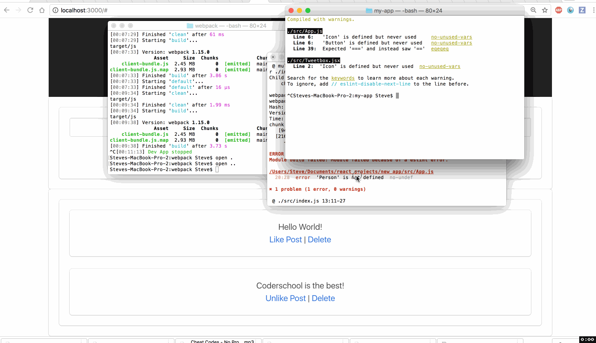

# REACT PREWORK:  Twitter Clone

The React Prework we made a twitter clone in which a user can add tweets, like, and delete them. 

Submitted by: **Steve Cho**

2017-October 30

Time spent: way_too_long

## User Stories

### Required:

* [x] User can add Tweet
* [x] Twitter box cannot post if more than 140 characters
* [x] As user types in twitter box, characters remaining displayed changes
* [x] User can like posts or unlike liked posts
* [x] User can remove posts

The following **additional** features are implemented:

* [x] can type in "Enter" and submit

The following **known issues**:

* List bugs or things that don't work yet

- current bugs: default twitter post displays unlike (so already liked)

## Video Walkthrough

Here's a walkthrough of implemented user stories:

GIF created with [LiceCap](http://www.cockos.com/licecap/).

## Notes

Describe any challenges encountered while building the app.

## License

    Copyright [yyyy] [name]

    Licensed under the Apache License, Version 2.0 (the "License");
    you may not use this file except in compliance with the License.
    You may obtain a copy of the License at

        http://www.apache.org/licenses/LICENSE-2.0

    Unless required by applicable law or agreed to in writing, software
    distributed under the License is distributed on an "AS IS" BASIS,
    WITHOUT WARRANTIES OR CONDITIONS OF ANY KIND, either express or implied.
    See the License for the specific language governing permissions and
    limitations under the License.